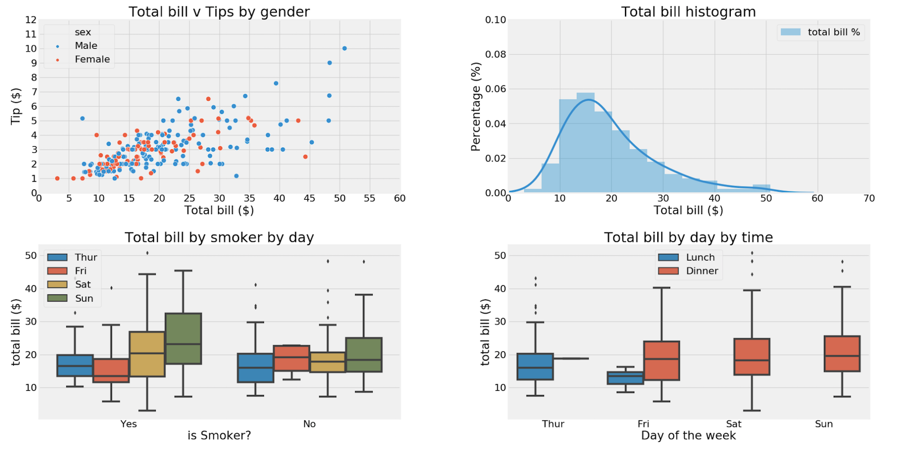

# Kevin Hanrahan Portfolio
Computer Information Systems student at Manhattan College

# [Project 1: Final Grade Prediction (Machine Learning)](https://github.com/k-x-h/FinalGradePrediction)
+ Performed exploratory data analysis and compared multiple linear models to predict the final grade of a student based on other values.
+ Project is written in Python and uses Pandas, Numpy, Matplotlib, Seaborn, Scikit-Learn, and tests models such as Linear, Decision Tree, and K-Nearest Neighbors regression models.

An example of some of the visualizations that are included in this project:

# [Project 2: Sentiment Analysis](https://github.com/k-x-h/Sentiment-Analysis)
+ Conducts a positive/negative and subjective/objective sentiment analysis on the most recent tweets containing a term specified by the user.
+ Project is written in Python and uses Pandas, Tweepy (For tweet scraping), and TextBlob (For sentiment analysis)
+ Defaults to pulling the 50 most recent tweets, but can be modified to go above (Provided that you stay within the Twitter API request limit)

Use of this project requires the user to have their own Twitter Dev API information (Consumer token/secret, access token/secret), but sample results have also been included (New_YorkSentimentAnalysis.csv)

# [Project 1](https://github.com/k-x-h/Sentiment-Analysis)
Regression cleaning etc

